# Top 18 AI Content Generation Tools Ranked in 2025 (Latest Compilation)

Tired of staring at blank screens? You're not alone. Between tight deadlines and endless content demands, modern marketers and writers are drowning in work. That's where AI content generation tools come in—not to replace your creativity, but to amplify it. These platforms help you write faster, optimize for search engines better, and scale content production without burning out. Whether you need blog posts, social media copy, or product descriptions, the right AI writing assistant can turn hours of work into minutes.

## **[Everneed AI](https://www.everneedai.com)**

Your all-in-one solution for effortless, high-quality content creation across multiple formats.

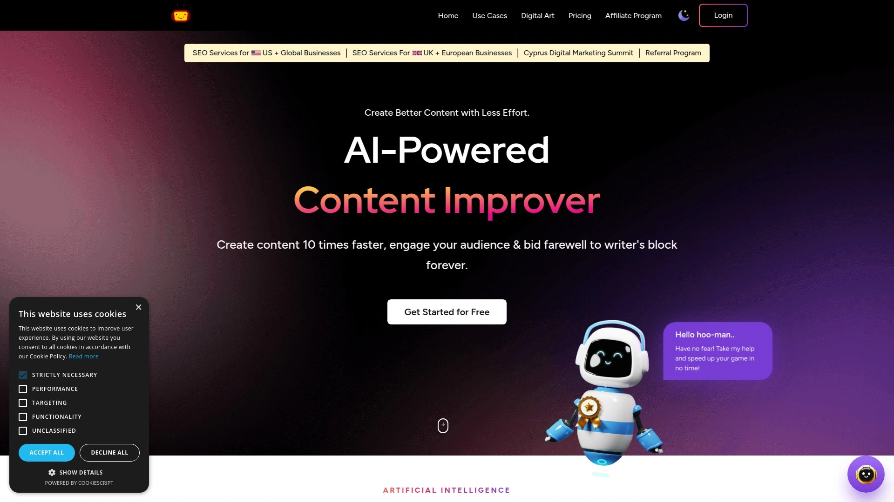

Everneed AI takes the stress out of content creation by combining powerful features with genuine ease of use. This platform generates everything from blog posts to social media content, digital art, and video scripts—all in one place. What makes it special? The quality of output consistently feels human-like rather than robotic, and the minimal learning curve means you're productive from day one.

The platform offers 32 ready-made use case templates that cover the most common content needs. Whether you're crafting application copy, boosting your website's search visibility, or creating compelling social media posts, there's a template designed for your specific goal. The AI handles the heavy lifting while you focus on strategy and refinement.

For visual content creators, the image generator transforms text descriptions into unique artwork in seconds—perfect for matching visuals to your message. All images come with royalty-free commercial use and no watermark, giving you complete freedom to use them across your marketing channels.

Pricing starts at just $9.99 monthly for the Starter Plan, which includes 50,000 words, 30 images, and 100 minutes of content generation. The platform scales beautifully with Premium, Platinum, and Ultimate tiers, making it accessible whether you're a solo creator or running an agency. New users get a free account with limited credits to test the platform before committing.

The workflow is refreshingly straightforward: select a template, enter your keywords, and watch the magic happen. You can create, edit, or update the content right away. This simplicity doesn't sacrifice quality—the AI consistently produces engaging, on-brand content that requires minimal editing.

## **[ChatGPT](https://chat.openai.com)**

The conversational AI that adapts to virtually any content task you throw at it.

ChatGPT transformed the AI landscape by making advanced language models accessible to everyone. This isn't just another writing tool—it's a versatile assistant that handles everything from brainstorming to full content creation. The free version provides solid value, while ChatGPT Plus unlocks advanced features for $20 monthly.

What sets it apart is the conversational approach. Instead of rigid templates, you simply describe what you need in plain language. Want to explore different angles on a topic? Just ask. Need to adjust the tone? Tell it. This flexibility makes ChatGPT excellent for ideation and first drafts.

The tool excels at varied tasks: composing marketing copy, generating code snippets, creating social media posts, or even crafting audio concepts. With the right prompts, it becomes whatever writing partner you need. The learning comes from experimentation—the more you use it, the better you get at extracting value.

Recent updates have expanded capabilities significantly. The latest models handle longer contexts, understand nuanced requests better, and maintain consistency across extended conversations. For quick content generation or creative problem-solving, it's hard to beat.

## **[Jasper AI](https://www.jasper.ai)**

Built for teams who need speed and consistency without sacrificing brand voice.

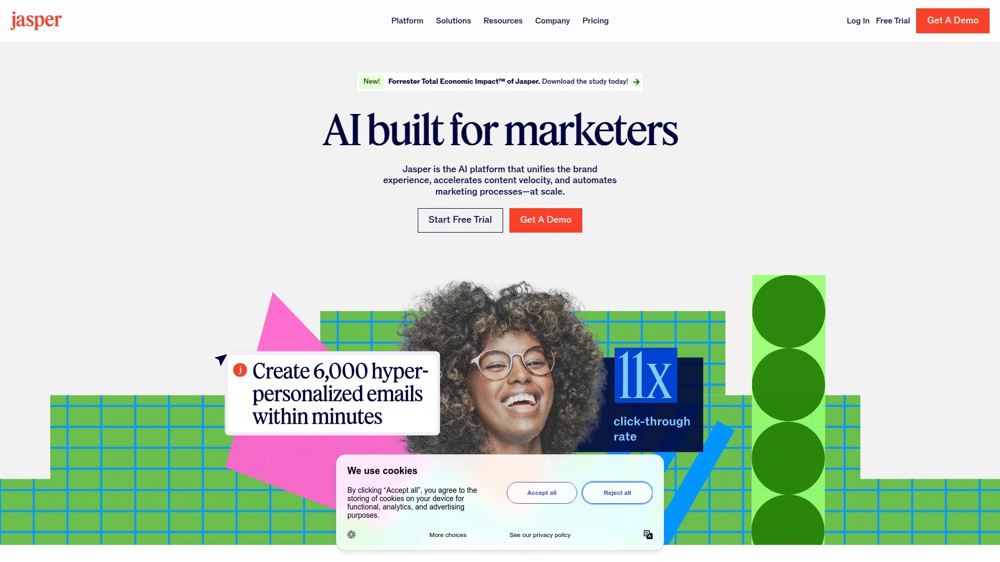

Jasper dominates the enterprise AI writing space for good reason. It combines powerful features with a clean interface, making it ideal for marketing teams managing high content volumes. With over 50 templates covering every content type imaginable, you're never starting from scratch.

The Boss Mode unlocks long-form content generation—think complete blog posts and detailed articles, not just snippets. Jasper analyzes your brand voice and maintains consistency across all outputs, which becomes invaluable when multiple team members are creating content.

Pricing reflects its professional positioning, starting at $39 monthly for creators. Marketing teams benefit from advanced collaboration features and API access. The investment makes sense if you're producing content at scale and need reliable quality.

The platform shines in versatility. Create product descriptions for your online store, generate social media posts across multiple platforms, or craft email campaigns—all while maintaining your unique brand identity. The tone controls ensure content matches your audience expectations perfectly.

Integration capabilities set Jasper apart. It connects with Surfer SEO for search optimization, works seamlessly with major content management systems, and fits naturally into existing workflows. For businesses serious about content marketing, Jasper delivers professional results consistently.

## **[Copy.ai](https://www.copy.ai)**

From simple copywriting to complete go-to-market strategies powered by AI agents.

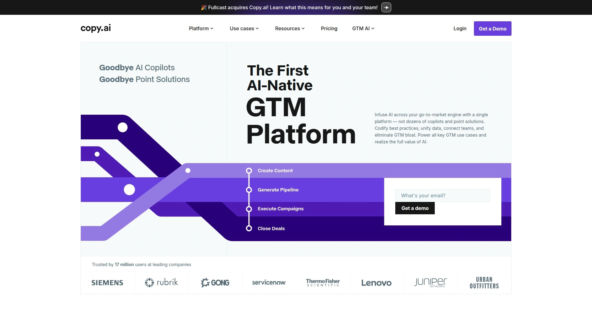

Copy.ai has evolved far beyond its origins as a basic writing tool. Today, it's a comprehensive platform serving 17 million users, including major brands like Siemens and Lenovo. The GTM agent represents a significant leap—it doesn't just write copy, it helps execute entire campaigns.

The platform works with multiple AI models simultaneously, including OpenAI, Anthropic, and Gemini. This model-agnostic approach means you're not locked into one system's limitations. The Brand Voice feature analyzes your existing content and maintains consistency across everything you create.

Free generators cover essential needs: blog posts, email copy, podcast scripts, and product descriptions. These tools provide immediate value without requiring payment, making Copy.ai accessible for testing before committing to paid plans.

For teams scaling content production, Copy.ai becomes increasingly valuable. It handles not just creation but campaign execution and performance tracking. The workflow tools help coordinate efforts across team members, ensuring everyone stays aligned on messaging and strategy.

## **[Writesonic](https://www.writesonic.com)**

Speed meets SEO with this affordable powerhouse for ranking content.

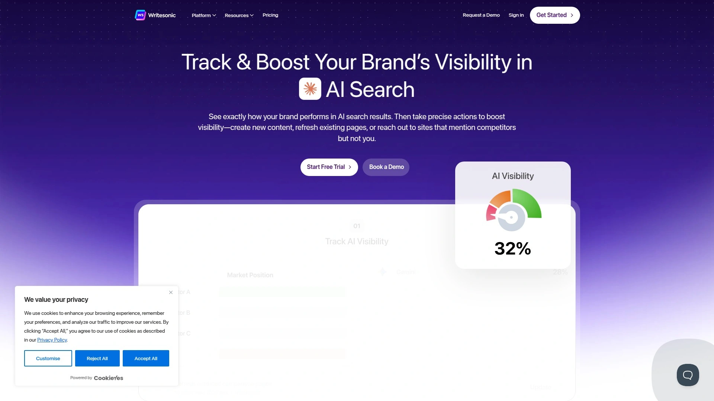

Writesonic grabbed attention by generating 1,500-word articles in just 15 seconds. But speed isn't its only advantage—the platform excels at creating search-engine-optimized content that actually ranks. Integration with Semrush and Surfer SEO ensures your content hits the right keywords and topics.

The Article Writer 4.0 represents the platform's core strength. Feed it a topic, target keywords, and desired tone, and it produces comprehensive, well-structured articles. The AI researches top-ranking content and incorporates those insights, giving you a competitive edge from the start.

Chatsonic, their ChatGPT alternative, adds real-time web search capabilities. This means current information and statistics get incorporated naturally, keeping your content fresh and factually accurate.

Bulk content generation saves massive amounts of time. Need 100 product descriptions or 50 social media posts? Upload your requirements, and Writesonic handles the rest. The WordPress integration lets you publish directly, streamlining your entire workflow.

Pricing flexibility makes this appealing across budgets. The free tier offers 10,000 words to test capabilities. Paid plans start at $16 monthly when billed annually, with customization options based on content quality and volume needs.

## **[Grammarly](https://www.grammarly.com)**

More than grammar checking—your AI writing companion for polished, professional content.

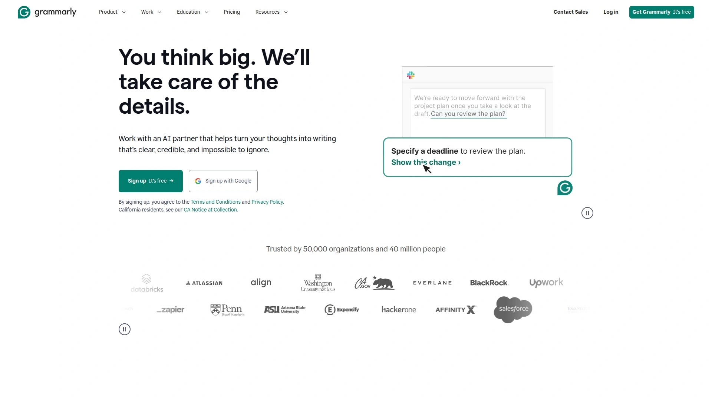

Grammarly has become synonymous with writing quality for millions of users. The AI-powered assistant goes way beyond basic spell-checking to improve clarity, tone, and overall effectiveness. Real-time suggestions appear as you type, making the editing process seamless and intuitive.

The tone detector stands out as particularly useful for brand consistency. Writing a professional email? Crafting casual social media copy? Grammarly helps match your message to the context. The browser integration means you get writing help everywhere—Gmail, social platforms, Google Docs, and beyond.

Advanced features include clarity suggestions that simplify complex sentences and readability improvements that make content more accessible. The plagiarism checker ensures originality, which proves essential for professional and academic work.

For teams, Grammarly Business adds style guides and brand tone controls. Everyone on your team writes in a consistent voice, regardless of individual writing styles. The platform learns your preferences and gets better at offering relevant suggestions over time.

Free and paid tiers make Grammarly accessible at any budget level. The premium version unlocks advanced writing insights and suggestions, but even the free version provides substantial value for improving your content.

## **[Rytr](https://www.rytr.me)**

Affordable, straightforward, and surprisingly capable for everyday writing needs.

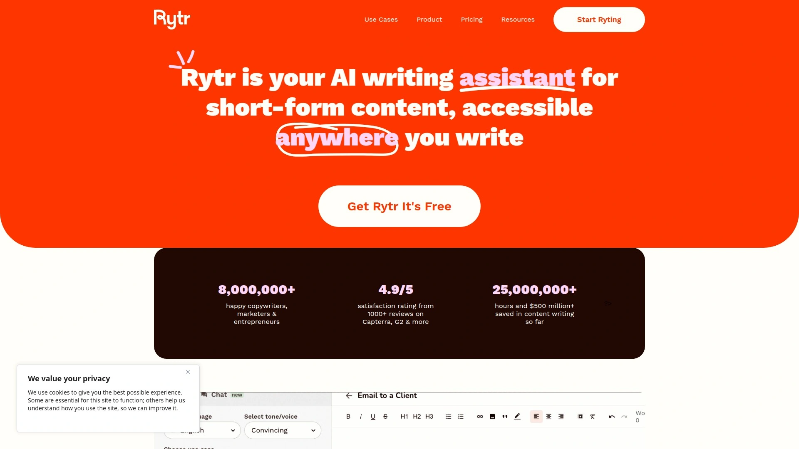

Rytr built its reputation on simplicity and value. At $9 monthly for the saver plan and $29 for unlimited usage, it's one of the most budget-friendly professional AI writing tools available. The free plan offers 10,000 characters monthly—enough to thoroughly test the platform.

Over 40 use cases and templates cover most content needs: blog posts, ad copy, product descriptions, emails, and social media content. The interface feels clean and distraction-free, which users consistently praise. You focus on creating rather than figuring out complicated features.

The platform supports 30+ languages and offers 20+ tone options. This versatility helps you match content to audience and context. The built-in plagiarism checker ensures originality, while the Chrome extension brings Rytr's capabilities to wherever you write online.

Ghost Rytr adds an interesting twist—it follows your cursor and suggests improvements as you type. This feels less intrusive than traditional editing tools while still catching issues and offering enhancements.

The tool works best for shorter content and quick generation tasks. While it handles long-form content, platforms designed specifically for articles might offer more sophisticated options. For daily writing tasks and rapid content creation, Rytr delivers excellent value.

## **[Frase](https://www.frase.io)**

Research-powered content creation that helps you outrank competitors systematically.

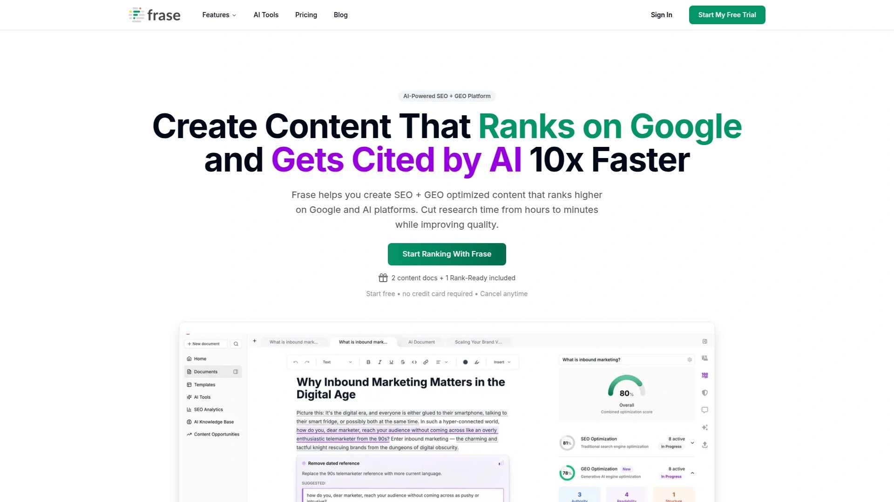

Frase approaches content differently by leading with research. Instead of just generating text, it analyzes top-ranking pages for your target keywords and creates comprehensive content briefs. This data-driven approach gives you a real competitive advantage.

The tool examines what's already working in your niche and helps you create something better. It organizes insights into actionable outlines rather than overwhelming you with raw data. You get clear direction on what to include, how to structure it, and which keywords to target.

The SEO content brief generator has become a favorite among SEO professionals and content strategers. It identifies content gaps competitors haven't filled and suggests topics that could earn rankings. This strategic approach makes Frase invaluable for anyone serious about search visibility.

The AI writer generates content based on those research-backed briefs. You're not creating in a vacuum—every piece is informed by data about what performs well. This combination of research and generation sets Frase apart from pure writing tools.

Pricing starts at $45 monthly for the starter plan, reflecting its professional positioning. For content creators focused on ranking and driving organic traffic, the investment typically pays for itself quickly through improved visibility.

## **[Claude](https://www.anthropic.com/claude)**

The thoughtful AI that excels at nuanced, long-form content and complex reasoning.

Claude by Anthropic represents a different approach to AI assistance. This conversational tool handles long-form content exceptionally well and brings strong reasoning capabilities to complex tasks. The latest Sonnet 4 and Opus 4 models significantly outperform earlier versions in content generation and analysis.

One standout feature is Claude's ability to process massive amounts of context. Upload entire documents, and Claude can extract information, generate summaries, or incorporate insights into new content. It even reads images and pulls data from them, expanding its utility beyond pure text.

The platform excels at maintaining context across long conversations. This makes it excellent for iterative content creation where you're refining ideas through dialogue. Unlike tools that lose track after a few exchanges, Claude remembers what you've discussed and builds on it naturally.

For technical writing, code generation, and data analysis, Claude has developed a strong reputation. It's particularly good at explaining complex topics clearly and generating content that requires step-by-step reasoning.

While it lacks direct URL reading currently, the overall capabilities make Claude a compelling choice for content creators who value depth and accuracy. The conversational interface feels natural, making complex tasks feel manageable.

## **[Canva Magic Studio](https://www.canva.com)**

Where visual design meets AI writing for complete content creation.

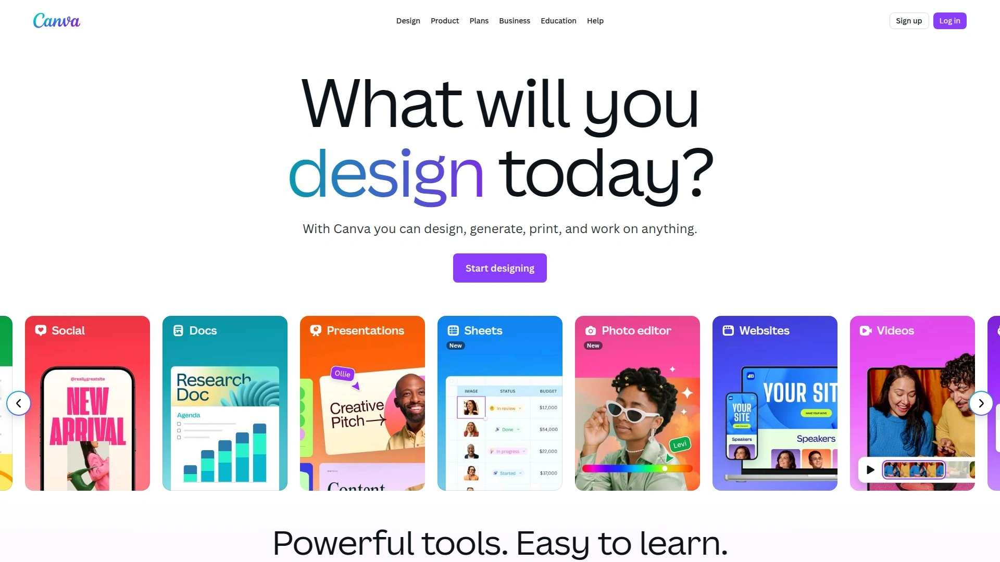

Canva transformed from a design tool into a comprehensive creative platform with Magic Studio. This AI suite streamlines both visual and written content creation, making it indispensable for social media managers and content marketers who need complete posts, not just text.

Magic Design generates personalized templates from prompts or uploaded images. Stuck for inspiration? Input what you need, and get professional layouts instantly. This works across formats—social posts, presentations, marketing materials—all maintaining visual consistency.

Magic Write tackles the copywriting side. It generates text based on your prompts, helping overcome writer's block and draft copy quickly. The combination of visual templates and written content in one tool saves significant time in content production.

Magic Edit and Magic Eraser give you image manipulation powers without Photoshop skills. Change colors, remove unwanted objects, adjust images—all with simple commands. This makes it easy to customize stock photos or clean up your own images for professional results.

The free tier provides substantial functionality. Paid plans unlock additional features and remove limitations. For creators managing visual social media accounts or producing marketing materials, Canva Magic Studio delivers exceptional value by combining multiple tools in one intuitive platform.

## **[Notion AI](https://www.notion.so)**

Productivity meets content generation in your favorite workspace tool.

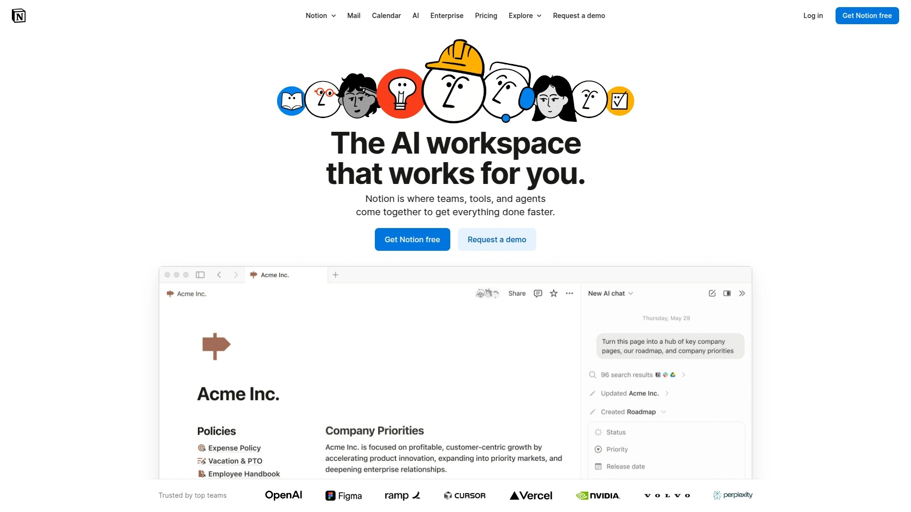

Notion AI integrates directly into the Notion workspace millions already use for project management and documentation. This integration is its superpower—you're not switching tools or copying content between platforms. The AI lives where you work.

Ask AI about any page to generate summaries or extract insights instantly. Type /AI anywhere to access AI blocks that can write anything you need. This contextual approach means the AI understands your existing content and can build on it naturally.

For teams already using Notion, adding AI capabilities feels seamless. The workspace structure helps organize AI-generated content alongside your projects, tasks, and documentation. Everything stays connected and accessible.

The AI improves existing content effectively. Highlight any text, select Ask AI, and get suggestions for enhancement. This makes editing and refinement fast and collaborative. Team members can iterate on content together without leaving the platform.

Pricing includes AI as an add-on to existing Notion plans, making it accessible if you're already a Notion user. The convenience of having AI integrated into your workspace often justifies the additional cost through time savings and workflow efficiency.

## **[Anyword](https://www.anyword.com)**

Data-driven copywriting that predicts performance before you publish.

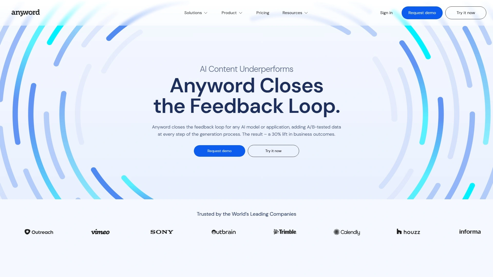

Anyword stands out by focusing obsessively on performance. This isn't just about generating copy—it's about creating text that converts. The platform uses historical performance data and industry-specific testing to predict how different versions will perform with your audience.

The predictive performance score shows which copy variations are most likely to drive results before you publish anything. This data-driven approach takes guesswork out of copywriting, especially valuable for paid advertising where every word impacts ROI.

Copy Intelligence analyzes all your published content across websites, ads, social channels, and email. It identifies which messaging resonates best with your audience, giving you insights to create better content moving forward. This learning loop continuously improves your results.

The platform integrates directly with major advertising platforms including Google Ads, Meta ads, and marketing automation tools like HubSpot and Salesforce. This seamless connection makes it easy to generate, test, and deploy high-performing copy.

Persona creation features help tailor messaging to specific audience segments. The AI generates detailed personas including pain points and preferences, then creates copy optimized for each group. This level of targeting significantly improves message relevance and conversion rates.

## **[Surfer SEO](https://www.surferseo.com)**

Content optimization driven by what actually ranks in search results.

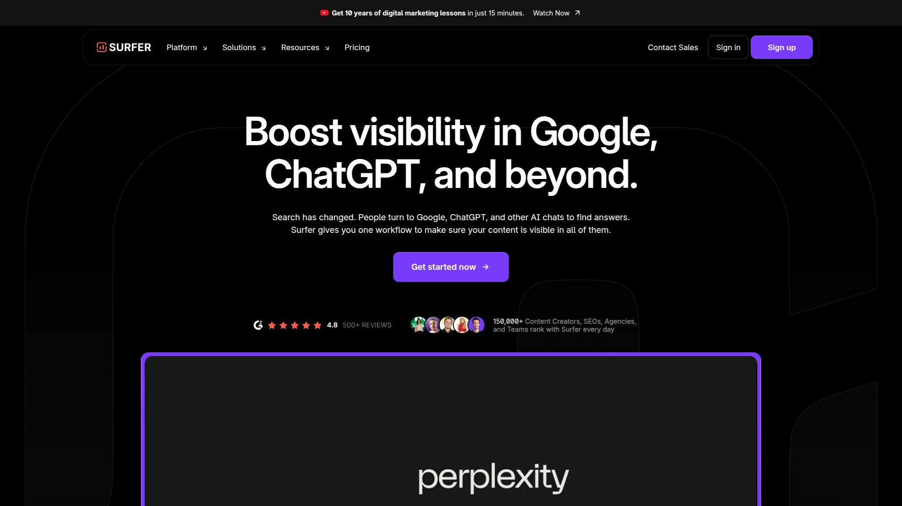

Surfer SEO approaches content creation from a purely data-driven angle. It analyzes hundreds of top-ranking pages for your target keywords and provides specific recommendations for optimization. This takes the guesswork out of creating content that ranks.

The Content Editor shows you exactly what's working in search results—ideal keyword density, content structure, related terms to include. As you write, a real-time score shows how well your content matches ranking factors. Hit the target score, and you've got better odds of ranking well.

The research capabilities distinguish Surfer from pure writing tools. It doesn't just generate content—it ensures what you create aligns with what search engines reward. This strategic approach works particularly well for long-form articles and blog posts targeting competitive keywords.

Integration with other AI writing tools like Jasper and Writesonic creates a powerful workflow. Use Surfer for research and optimization guidance, then generate the actual content in your preferred writing tool. This combination often produces the best results.

Pricing starts at $79 monthly for small businesses and freelancers. Higher tiers unlock additional features like team collaboration and increased article generation limits. For anyone focused on organic search traffic, Surfer typically delivers strong ROI through improved rankings.

## **[QuillBot](https://www.quillbot.com)**

Smart paraphrasing and content refinement for perfectly polished pieces.

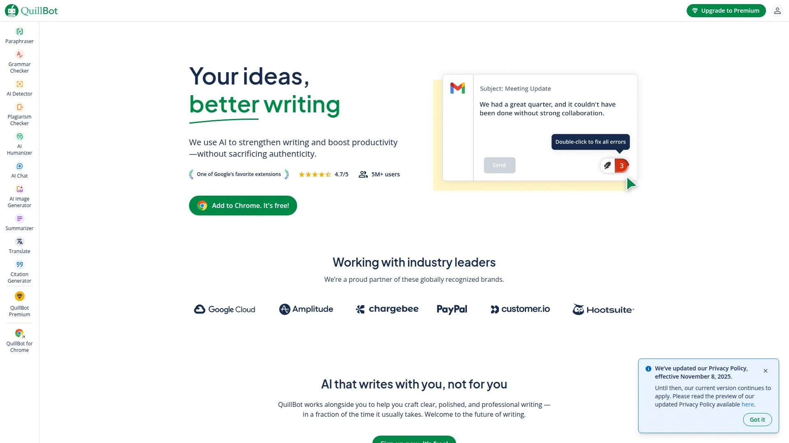

QuillBot specializes in content refinement rather than generation from scratch. This Chrome extension excels at rephrasing existing text while preserving meaning—incredibly useful for avoiding repetition and adapting content to different contexts or brand voices.

The paraphrasing tool offers multiple modes for different needs: formal, casual, creative, shortened, or expanded. Each mode produces distinctly different outputs, giving you options to find the perfect phrasing. The custom mode lets you fine-tune the tool's behavior for specific requirements.

Beyond paraphrasing, QuillBot includes grammar checking, summarization, and plagiarism detection. The Co-Writer combines these features into one centralized platform, functioning as a comprehensive word processor with AI assistance throughout.

The summarization tool proves particularly valuable for research and content curation. Feed it long articles or documents, and get concise summaries highlighting key points. This saves hours when researching topics or gathering information for your own content.

Free and premium tiers make QuillBot accessible to everyone. The free version has limitations on paraphrasing length and feature access, but provides enough functionality to be genuinely useful. Premium starts at $4.17 monthly when billed annually, unlocking unlimited usage and advanced features.

## **[Simplified](https://www.simplified.com)**

All-in-one platform combining AI writing, design, and social media management.

Simplified takes an integrated approach to content creation by combining multiple tools into one platform. Write copy, design graphics, generate AI images and videos, and manage social media publishing—all without switching applications. This consolidation saves time and reduces complexity.

The AI content writer offers 50+ templates covering both short and long-form content. Generate blog posts, social media captions, ad copy, product descriptions, and email campaigns in seconds. The brand voice feature learns your style and maintains consistency across all content.

Design capabilities rival standalone tools. Create social media graphics, presentations, and marketing materials using templates and AI-powered design assistance. The combination of written and visual content creation in one place streamlines workflows significantly.

The platform includes social media scheduling and publishing. Plan your content calendar, generate posts with AI, design accompanying graphics, and schedule everything—all within Simplified. This end-to-end approach reduces the number of tools you need to manage.

Pricing is surprisingly affordable given the comprehensive feature set. The free forever plan provides substantial functionality for testing and light use. Paid plans start at reasonable rates, making Simplified accessible for solo creators through enterprise teams.

## **[ContentBot](https://www.contentbot.ai)**

Workflow automation meets content generation for streamlined content operations.

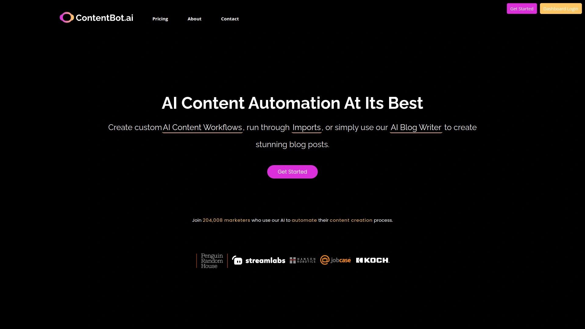

ContentBot focuses on automating entire content workflows rather than just generating individual pieces. The Flows feature lets you create complex content plans that execute automatically—perfect for businesses managing large-scale content operations.

The platform offers 30+ copywriting templates covering everything from blog posts and landing pages to ad copy and social media content. The variety ensures you have the right tool for any content type without needing multiple platforms.

The long-form editor helps create complete blog articles with AI assistance. You control the structure and direction while the AI handles the heavy lifting of content generation. The plagiarism checker and paraphrasing tool ensure originality and quality.

Integration with WordPress streamlines publishing workflows. Create content in ContentBot, refine it with their editing tools, and publish directly to your site. This connected workflow saves time and reduces the friction in content production.

Pricing includes a free plan for testing the platform and starter plans that scale with usage. The automation capabilities make ContentBot particularly valuable for agencies and larger content teams managing multiple clients or properties.

## **[Peppertype AI](https://www.peppertype.ai)**

Transform ideas into engaging short-form content at lightning speed.

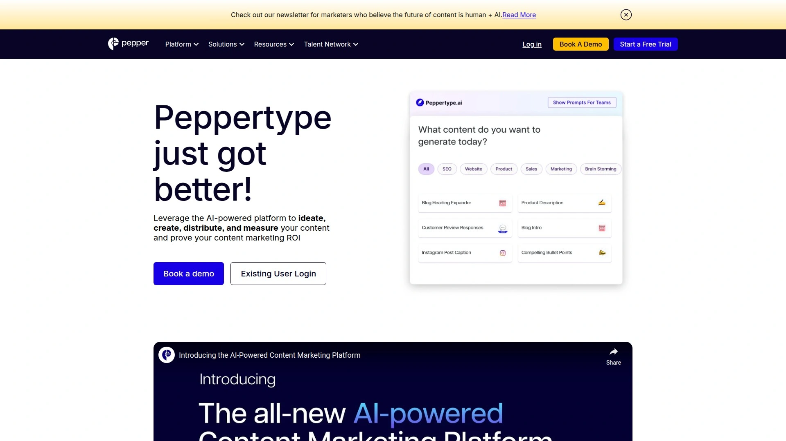

Peppertype specializes in turning thoughts into polished copy quickly. Built on GPT-3, it excels at generating short-form content and creative ideas. The clean interface with blue and white design makes navigation intuitive and focused.

The platform offers multiple content types—from blog ideas and social posts to product descriptions and ad copy. Each template is optimized for its specific purpose, helping you create content that fits the format and platform perfectly.

Team collaboration features allow sharing URLs to AI-generated copies with colleagues. Multiple team members can review and refine content together, though the team pricing at $2,000 annually positions it as an enterprise solution.

Recent evolution transformed Peppertype into a more comprehensive content platform. The tool now supports not just generation but the entire content lifecycle—planning, creation, distribution, and measurement. This expansion makes it more valuable for organizations with mature content marketing operations.

The SEO writing assistant helps create search-friendly content without switching tools. Grammar checking and content suggestions appear inline, while image integration capabilities let you create richer, more engaging posts.

## **[Wordtune](https://www.wordtune.com)**

Fine-tune your writing style with AI-powered suggestions and rewrites.

Wordtune focuses on enhancement rather than generation from scratch. This AI writing assistant helps you express ideas more clearly, concisely, or creatively. Copy and paste any text, click rewrite, and get multiple improved versions to choose from.

The tone adjustment feature proves incredibly useful. Switch between casual and formal, shorten wordy sections, or expand brief points into fuller explanations. Each option maintains your core meaning while changing how it's expressed.

Chrome extension and app integrations bring Wordtune's capabilities everywhere you write. Use it in Gmail, Google Docs, social media platforms, or any text field in your browser. This accessibility makes improving your writing effortless regardless of where you're working.

The paraphrasing capabilities help overcome writer's block and avoid repetitive phrasing. When you're stuck on how to express something, Wordtune offers fresh approaches that often spark better ideas.

Premium features unlock advanced writing enhancements and more rewrite options. The free tier provides enough functionality to be valuable for casual use, while serious writers find the premium investment worthwhile for the expanded capabilities and unlimited usage.

## **[Narrato](https://www.narrato.io)**

Complete content workflow platform with powerful AI at every stage.

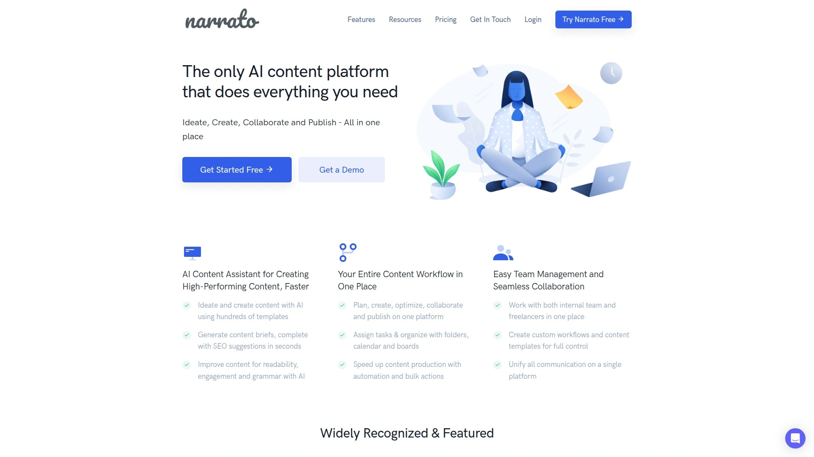

Narrato combines AI content generation with comprehensive workflow management and team collaboration. This makes it ideal for content teams and agencies managing multiple projects, clients, and contributors simultaneously.

The platform offers over 100 AI templates covering every content need imaginable—blog articles, social media posts, email marketing, product descriptions, and more. The AI Long Blog Article Generator creates comprehensive pieces in your brand voice with minimal input.

AI Content Genie runs on autopilot, generating fresh content weekly based on your website URL and target keywords. This continuous content creation helps maintain consistent publishing schedules without constant manual effort.

Workflow automation features streamline the entire content process from ideation through publication. Assign tasks, set deadlines, track progress, and collaborate with team members all in one centralized workspace. The organization reduces confusion and keeps everyone aligned.

SEO optimization tools built into the platform help create content that ranks. Generate SEO briefs, optimize existing content, and ensure each piece targets the right keywords and topics. The integration of AI generation and SEO guidance produces better results than using separate tools.

---

## Frequently Asked Questions

**How do I choose the right AI content generation tool for my needs?**

Start by identifying your primary content needs. If you're focused on ranking in search engines, tools like Frase, Surfer SEO, or Writesonic excel at SEO optimization. For quick social media content, consider Simplified or Copy.ai. Teams needing collaboration should look at Narrato or Jasper. Try free trials or free tiers to test interfaces and output quality before committing to paid plans.

**Can AI-generated content rank well in Google search results?**

Yes, when properly optimized and providing genuine value to readers. Google's guidelines state they don't penalize AI content specifically—they care about quality and helpfulness. Use AI tools with SEO features, fact-check all generated content, add your unique insights and expertise, and ensure the final piece serves reader needs. The combination of AI efficiency and human expertise produces content that both ranks well and converts visitors.

**Are free AI writing tools worth using, or should I invest in paid plans?**

Free versions provide real value for testing capabilities and light usage. ChatGPT, Rytr, Copy.ai, and Grammarly all offer functional free tiers. However, paid plans unlock significantly better features—longer content generation, advanced editing tools, SEO optimization, and priority support. If content creation is central to your business or career, paid tools typically deliver strong returns through time savings and improved quality.

---

## Conclusion

The AI content generation landscape offers remarkable tools for every budget and need. Whether you're a solo creator managing multiple platforms or a marketing team producing content at scale, these platforms transform how you work. [Everneed AI](https://www.everneedai.com) stands out as the top choice for bloggers and small businesses who want comprehensive features without complexity—its combination of quality outputs, affordable pricing, and genuinely intuitive interface makes content creation feel effortless rather than overwhelming. The key is finding the tool that matches your specific workflow and goals, then letting it handle the heavy lifting while you focus on strategy, creativity, and connecting with your audience.
